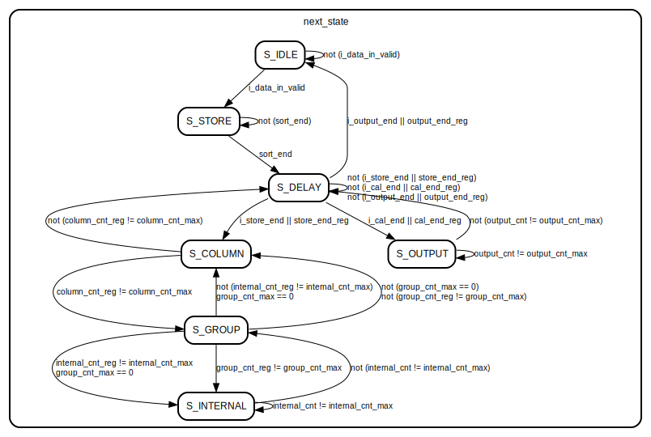

# Configurable FFT Acceleration Operator on Zynq

This repository contains the Verilog source code and documentation for the **Design and Implementation of an FFT Acceleration Operator Based on Zynq**.

The project implements a hardware accelerator for the Fast Fourier Transform (FFT) on an FPGA, designed to offload computationally intensive tasks from a general-purpose processor.

*Please rebuild the Vivado2018.3 project using `rebuild.tcl` in ./misc after configuring `origin_dir`*

---

## Key Features

- **Algorithm**: Decimation-In-Time (DIT) Radix-2 FFT.
- **Architecture**: Resource-efficient iterative structure with natural order output.
- **Data Path**: 32-bit fixed-point representation.
- **High Configurability**:
    - Supports variable FFT point sizes from **8 to 8192**.
    - Supports both forward **FFT** and **Inverse FFT (IFFT)** modes.
- **Platform**: Implemented in Verilog and verified on a Zynq-7020 SoC platform.

## Hardware Architecture

The operator is designed with a modular approach, consisting of four primary units:
- **`Control_unit`**: A Finite State Machine (FSM) that orchestrates the entire operation, generating addresses and control signals.
- **`Data_RAM`**: Implemented with a ping-pong buffer structure using dual-port BRAMs to avoid read/write conflicts during computation.
- **`Twiddle_factor_ROM`**: Stores pre-computed twiddle factors to save computational resources.
- **`Butterfly_unit`**: The core computational engine that performs the Radix-2 butterfly operations.

The system communicates with the Zynq Processing System (PS) via the AXI4-LITE bus for configuration and data transfer.

## Performance Highlights

The implemented operator was verified on a Zynq-7020 board and demonstrated significant performance gains:

- **Max Clock Frequency**: **110 MHz**, achieved through pipelining optimizations on the critical path.
- **Accuracy (SQNR)**: Achieves an average Signal-to-Quantization-Noise Ratio of **65.3 dB** in FFT mode.
- **Acceleration**: Provides an average **speed-up of 8.5x** compared to an ARM Cortex-A9 processor running the optimized CMSIS-DSP library.
- **Resource Utilization**: The design maintains a low hardware footprint, utilizing only **4.02% of LUTs** and **3.64% of DSP slices** on the target device.

## Repository Structure
.  
├── coe/                           # Contains .coe files for ROM/RAM initialization  
├── fft_top_new.srcs/              # Vivado's default source directory  
│   ├── constrs_1/  
│   │   └── new/                   # Constraint files (.xdc)  
│   ├── sim_1/  
│   │   └── new/                   # Simulation-related sources (Testbenches)  
│   └── sources_1/                 # Primary design sources (RTL and IP)  
│       ├── ip/                    # ... IP core configuration files (.xci)  
│       └── new/                   # ... User-created Verilog files  
├── misc/                          # Miscellaneous files, e.g., the project report  
├── rtl/                           # Contains the core RTL design files (.v)  
├── tb/                            # Contains top-level testbenches  
├── .gitignore                     # Git ignore configuration file  
├── LICENSE                        # Project license file  
├── README.md                      # This README file  
└── tb_fft_top_new_behav.wcfg      # Vivado simulation waveform configuration  

## FSM State Diagram

## License

This project is licensed under the **MIT License**. See the `LICENSE` file for details.
